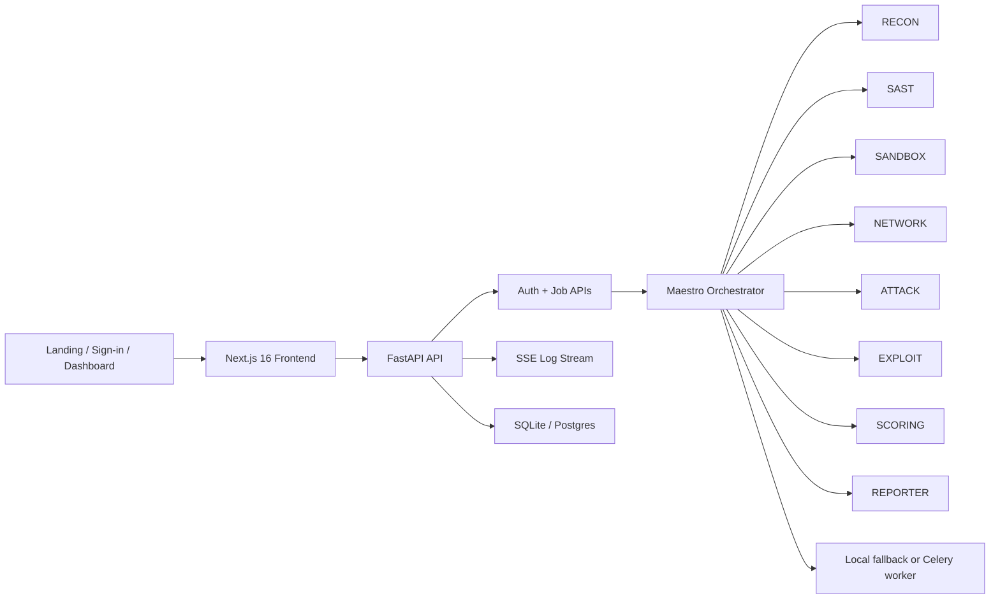

# FireCrow FCv1

FireCrow is an AI-powered security audit platform for repository intake, static analysis, sandboxed runtime probing, exploit validation, CVSS scoring, and report delivery. The project combines a FastAPI backend, a Next.js frontend, a resilient local launcher, and a smoke-test path that exercises the real orchestration flow end to end.

Built by Nova Devs.

## Why FireCrow

- Multi-stage audit orchestration: repository clone, SAST, sandbox, network scan, attack, exploit proofing, scoring, reporting, and cleanup.
- Product-grade frontend: public landing page, sign-in flow, protected dashboard, and legal pages.
- Local-first developer experience: dynamic port fallback, service reuse, SQLite-friendly setup, optional Redis/Celery, optional Docker sandboxing.
- Verification built in: smoke testing and validation scripts are part of the repo, not tribal knowledge.

## Product Surfaces

- `/`: public landing page for FireCrow FCv1
- `/signin`: branded sign-in flow backed by the auth API
- `/dashboard`: protected audit console
- `/terms`: Terms and Conditions page
- `/health`: backend health endpoint
- `/api/v1/system/status`: readiness snapshot for the frontend and operator checks

## Architecture



## Core Stack

| Layer | Technology |
| --- | --- |
| Frontend | Next.js 16, React 19, TypeScript |
| Backend | FastAPI, SQLAlchemy, Pydantic Settings |
| Orchestration | Maestro runtime, BackgroundTasks fallback, optional Celery |
| Storage | SQLite for local work, PostgreSQL-ready config |
| Streaming | Server-Sent Events for live agent logs |
| Reports | Local report artifacts with optional object storage config |
| Validation | Pytest, ESLint, Next build, Pyright, smoke script |

## Agent Pipeline

FireCrow currently exposes these orchestration roles through the runtime and system-status surface:

- `MAESTRO`: orchestration and lifecycle control
- `RECON`: repository clone and stack discovery
- `SAST`: secrets and unsafe-code analysis
- `SANDBOX`: Kali or simulated runtime provisioning
- `NETWORK`: port and service discovery
- `ATTACK`: active vulnerability scanning
- `EXPLOIT`: proof generation
- `SCORING`: CVSS prioritization
- `REPORTER`: report generation
- `GITHUB_MCP`: issue and PR generation support
- `GOOGLE_AGENT`: downstream alerting and assessment support

## Quick Start

### 1. Prerequisites

- Windows PowerShell
- Python 3.12 with a project virtual environment at `.venv`
- Node.js and `npm`
- Redis only if you want Celery locally
- Docker only if you want a real sandbox instead of simulation

### 2. Environment

Backend configuration lives in `backend/.env.example`.

```powershell
Copy-Item backend/.env.example backend/.env.local
```

Key local-development defaults:

- `DEBUG=true`
- `FRONTEND_URL=http://localhost:3000`
- `DATABASE_URL=sqlite:///./firecrow.db`
- `FIRE_CROW_MOCK_SANDBOX=true` for local sandbox simulation

The backend also reads `.env`, `backend/.env`, `.env.local`, and `backend/.env.local`, with later files taking precedence.

Frontend configuration lives in `frontend/.env.example`.

```powershell
Copy-Item frontend/.env.example frontend/.env.local
```

Primary frontend setting:

- `NEXT_PUBLIC_API_URL=http://localhost:8000/api/v1`

### 3. Start the stack

From the repository root:

```powershell
npm run dev
```

That launcher will:

- start the backend on the first free port at or after `8000`
- start the frontend on the first free port at or after `3000`
- reuse already healthy services instead of starting duplicates
- inject the matching backend URL into the frontend process
- start Celery only when Redis is reachable

Frontend plus backend only:

```powershell
npm run dev:no-worker
```

Request specific starting ports:

```powershell
powershell -ExecutionPolicy Bypass -File scripts/start-dev.ps1 --skip-worker --backend-port 8010 --frontend-port 3001
```

### 4. Open the app

Use the frontend URL printed by the launcher. The default target is usually:

```text
http://localhost:3000
```

## Authentication Model

FireCrow currently supports database-backed local workspace authentication through the backend auth routes.

- `POST /api/v1/auth/login`: creates a signed workspace session token
- `POST /api/v1/auth/register`: creates a database-backed user/workspace
- `GET /api/v1/auth/me`: validates the current session

In debug mode, the backend can auto-create local users for fast testing. That keeps development friction low while preserving a real token-based API contract for the frontend.

## Verification

Run the live smoke test:

```powershell
npm run smoke
```

This checks:

- landing page
- sign-in page
- terms page
- backend health
- auth login
- auth session lookup
- system readiness
- audit submission
- terminal job lifecycle
- report generation
- SSE completion events

Run the broader validation suite:

```powershell
npm run validate
```

That wrapper runs:

- frontend lint
- frontend production build
- backend Pyright type-checking
- backend pytest suite

## Local Sandbox Behavior

FireCrow can run in two useful local modes:

- `simulation`: no live Docker dependency, best for fast testing and CI-like flows
- `docker`: real sandbox provisioning when Docker is available and configured

The backend reports the active mode from `/api/v1/system/status`, and the dashboard renders that state directly.

## Key API Endpoints

| Endpoint | Purpose |
| --- | --- |
| `GET /health` | backend health |
| `POST /api/v1/auth/login` | sign in and issue token |
| `POST /api/v1/auth/register` | create a local account |
| `GET /api/v1/auth/me` | validate current token |
| `GET /api/v1/system/status` | service, integration, and agent readiness |
| `POST /api/v1/audit/submit` | create an audit job |
| `GET /api/v1/audit/jobs` | list workspace jobs |
| `GET /api/v1/audit/job/{job_id}` | retrieve job detail and findings |
| `DELETE /api/v1/audit/job/{job_id}` | request cancellation |
| `GET /api/v1/audit/{job_id}/stream` | SSE log stream |

## Repository Layout

```text
Fire Crow/
|- backend/
|  |- app/
|  |  |- api/
|  |  |- agents/
|  |  |- orchestrator/
|  |  |- services/
|  |  |- workers/
|  |- tests/
|- frontend/
|  |- src/app/
|  |  |- page.tsx
|  |  |- signin/
|  |  |- dashboard/
|  |  |- terms/
|- scripts/
|  |- dev.py
|  |- smoke.py
|  |- validate.py
|- workspace/
|  |- reports/
```

## Orchestration Pipeline & Reliability Audit

FireCrow employs a 7-stage orchestration pipeline built on LangGraph. Here is a summary of the stages, critical failure points, and resilience features:

### 1. The 7 Orchestration Stages
1. **RECON (`recon_node`)**: Clones the repository, detects tech stack (Python, NodeJS, Go, Java, Docker), and lists manifests.
   - *Failure point*: Git clone failures or malicious repositories.
   - *Mitigation*: Depth=1 clone, strict input validation (no command options), 500MB size limit, symlink escape checks, git hooks removal.
2. **DEPENDENCY (`dependency_node`)**: Performs dependency vulnerability scanning using `osv-scanner` or `trivy`.
   - *Failure point*: Missing scanner binaries.
   - *Mitigation*: Falls back to simulated findings in debug mode, or returns `[]` in production, without crashing the job.
3. **SAST & SEMGREP (`sast_node`, `semgrep_node`)**: Scans code files for secrets and unsafe patterns using regexes and Semgrep.
   - *Failure point*: ReDoS hangs, missing Semgrep binary.
   - *Mitigation*: Skips files >2MB, truncates lines >2048 chars, catches individual file errors, falls back gracefully.
4. **SANDBOX (`sandbox_node`)**: Provisions private Docker network and target/testing containers.
   - *Failure point*: Missing Docker daemon in production environments (e.g. Render).
   - *Mitigation*: Explicit `FIRE_CROW_MOCK_SANDBOX=true` setting enables full simulation.
5. **DYNAMIC DYNAMIC PROBING (`network_node`, `attack_node`, `exploit_node`)**: Performs port scan, dynamic attacks (sqlmap, nuclei), and exploit proofing.
   - *Failure point*: Container exec errors.
   - *Mitigation*: Commands run in sandboxed Kali container, are restricted by executable allowlists, and errors are handled per-command.
6. **ANALYSIS (`ai_analyzer_node`, `scoring_node`)**: Runs LLM deduction, deduplicates findings, scores severities using CVSS.
   - *Failure point*: Gemini API timeouts or rate limits.
   - *Mitigation*: Iterates fallback models, falls back to simulated remediation without failing the job if all models fail.
7. **DELIVERY & CLEANUP (`reporter_node`, `github_mcp_node`, `google_agent_node`, `cleanup_node`)**: Compiles PDF, uploads to R2, alerts workspace via email (Resend/Brevo/SMTP), creates GitHub issue/PR via GitMCP, tears down sandboxes.

### 2. Critical Configuration & Crash Protections

- **R2 / S3 Endpoint Scheme**:
  - *Issue*: `ValueError: Invalid endpoint: s3.us-east-005.backblazeb2.com` when endpoint has no protocol scheme.
  - *Fix*: The system automatically prepends `https://` if `R2_ENDPOINT_URL` or `CLOUDFLARE_R2_ENDPOINT` is configured without a scheme.
- **GitMCP Integration**:
  - *Issue*: SSE remote server connection fails (`403 Forbidden`) when permissions are missing.
  - *Fix*: Failing to connect to `gitmcp.io` is logged as a warning and falls back to direct GitHub REST API using `GITHUB_TOKEN`.
- **E-mail Delivery & Port Blocking**:
  - *Issue*: Render blocks outbound SMTP ports (25, 465, 587).
  - *Fix*: Use `BREVO_API_KEY` (via Brevo HTTPS API) or `RESEND_API_KEY` to send emails over port 443.
- **LangGraph State Reduction**:
  - *Issue*: Incremental dictionary updates to `scanner_execution` overwritten by default LangGraph reducers.
  - *Fix*: Custom `merge_dicts` reducer ensures compiled results from all scanners persist correctly.

## Development Notes

- The launcher is intentionally defensive: it avoids duplicate services and falls forward on busy ports.
- The orchestration runtime owns terminal-state decisions, cancellation finalization, and cleanup.
- The dashboard understands `completed`, `failed`, `cancelled`, and `partial` terminal states.
- Local report files are generated in `workspace/reports`.

## Current Focus

FireCrow is already usable as a local full-stack security-audit workspace, and the repo is structured around making orchestration reliability testable. The next natural improvements are deeper auth UX, richer report delivery, and stronger production deployment scaffolding around the same API/runtime contracts.
