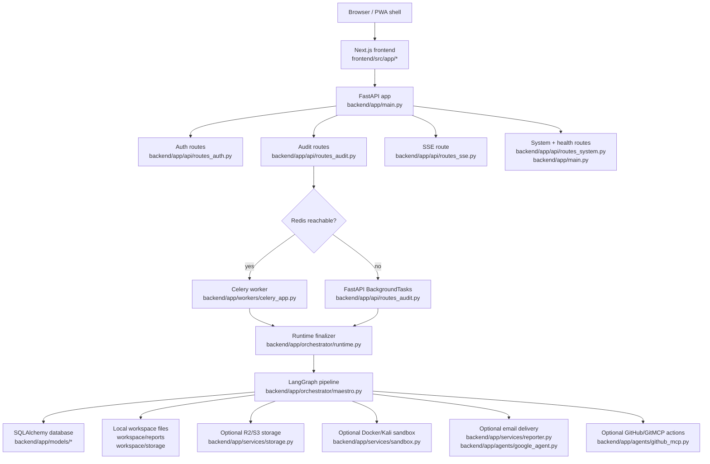

# Architecture

This document describes the current repository shape backed by `backend/app/main.py`, `backend/app/orchestrator/maestro.py`, `backend/app/services/*`, and `frontend/src/app/*`.

## High-Level Diagram

## Request Flow

1. The browser loads UI routes from `frontend/src/app/*`. In containerized deployment, `backend/app/main.py` can mount `frontend/out` at `/`.
2. Frontend API calls go through `frontend/src/shared/api/client.ts`, which uses `NEXT_PUBLIC_API_URL` or a localhost fallback.
3. Authenticated calls carry a bearer token from `frontend/src/lib/authSession.ts`; the backend also accepts the auth cookie in `backend/app/services/auth.py`.
4. `backend/app/main.py` applies request-size checks, request IDs, security headers, CORS, and SlowAPI rate limiting before routing.

## Audit Job Lifecycle

Source paths: `backend/app/api/routes_audit.py`, `backend/app/orchestrator/runtime.py`, `backend/app/orchestrator/maestro.py`, `backend/app/models/audit_job.py`.

1. `POST /api/v1/audit/submit` validates the request, enforces the per-user active job cap, creates an `AuditJob`, and writes an `AuthorizationAttestation`.
2. The route dispatches work to Celery when Redis is reachable or to FastAPI `BackgroundTasks` otherwise.
3. `execute_audit_job()` initializes `AuditState`, restores GitHub token context from the user record, and invokes the compiled LangGraph.
4. Each phase writes `AgentLog` rows and `PhaseLedgerModel` rows.
5. The orchestrator includes retry mechanisms with exponential backoff for transient failures in non-critical phases.
6. Final status is resolved in `backend/app/orchestrator/runtime.py` as `completed`, `partial`, `failed`, or `cancelled`.
7. Reports are generated as artifacts and later downloaded through authenticated routes.

## Frontend / Backend Boundary

Source paths: `frontend/src/shared/api/endpoints.ts`, `frontend/src/features/auth/api.ts`, `frontend/src/features/audits/api.ts`.

- Frontend does not call the database directly.
- Frontend uses JSON APIs for auth, jobs, job detail, and system status.
- SSE is read directly by `frontend/src/shared/hooks/useSSE.ts`.
- Report download uses a raw `fetch()` to `GET /api/v1/audit/job/{job_id}/report` and opens the returned blob in a new tab.

## Database And Object Storage Boundary

Source paths: `backend/app/models/*`, `backend/app/services/storage.py`, `backend/app/api/routes_storage.py`.

- Relational state lives in the configured SQL database: users, sessions, jobs, findings, logs, artifacts, memberships, policy/security logs, and attestation records.
- Large report and evidence files go through `StorageService.upload_artifact()`.
- If R2/S3-compatible storage is configured, artifact metadata still lands in the database and the file object goes to object storage.
- If object storage is unavailable, files are stored under `workspace/storage`.

## Background Worker Behavior

Source paths: `backend/app/api/routes_audit.py`, `backend/app/workers/celery_app.py`.

- Celery is optional in the current repository.
- `_is_broker_reachable()` probes Redis with a short socket connect.
- If Redis is unavailable, the API logs the fallback and schedules the job in-process using `BackgroundTasks`.
- `backend/app/workers/scheduler.py` exists, but its periodic scan dispatch logic is still placeholder text.

## SSE Streaming Behavior

Source paths: `backend/app/api/routes_sse.py`, `frontend/src/shared/hooks/useSSE.ts`.

- The SSE endpoint is `GET /api/v1/audit/{job_id}/stream`.
- It re-checks job ownership before streaming and again on each polling cycle.
- It emits:
  - `connect` when the stream opens
  - `log` for each new `AgentLog`
  - `complete` when the job reaches a terminal state
  - `error` if the stream breaks
- The backend sends a keepalive comment roughly every 15 seconds when idle.

## Report Generation Flow

Source paths: `backend/app/orchestrator/maestro.py`, `backend/app/services/reporter.py`, `backend/app/services/storage.py`.

1. The reporter phase collects reportable findings from the current `AuditState`.
2. `ReportGenerator.generate_html_report()` renders the report body.
3. `compile_pdf()` uses WeasyPrint when available.
4. If WeasyPrint is unavailable, the code writes an `.html` file plus a simulated placeholder `.pdf`.
5. The report is uploaded through `StorageService.upload_artifact()`, and the job stores an `artifact://...` URL.
6. `GET /api/v1/audit/job/{job_id}/report` resolves the artifact to either a presigned URL, a local file, or an HTML fallback.

## Optional Integrations

Source paths: `backend/app/api/routes_auth.py`, `backend/app/agents/github_mcp.py`, `backend/app/agents/google_agent.py`, `backend/app/services/reporter.py`.

- GitHub OAuth: optional
- Google OAuth: optional
- GitHub/GitMCP issue and PR creation: optional
- Gemini/OpenAI-assisted analysis: optional
- Email sending through SMTP, Resend, or Brevo: optional
- Cloudflare R2 / S3-compatible artifact storage: optional

The code usually degrades gracefully in debug mode and more conservatively in non-debug mode.

---
*Documentation last updated: June 19, 2026*
