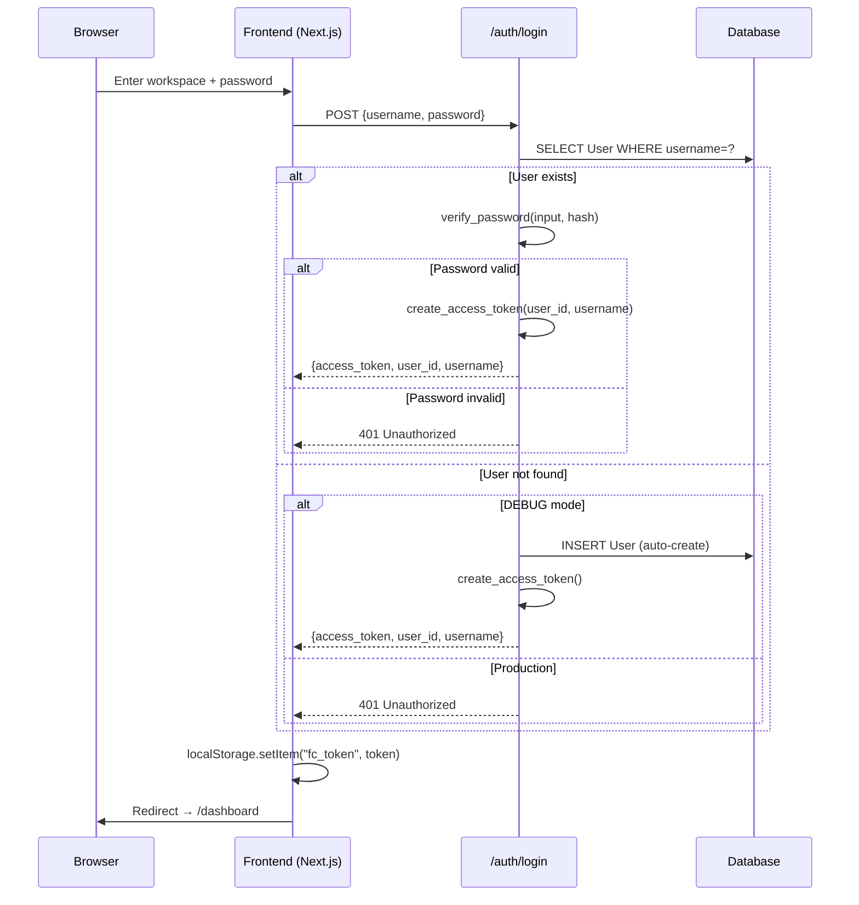
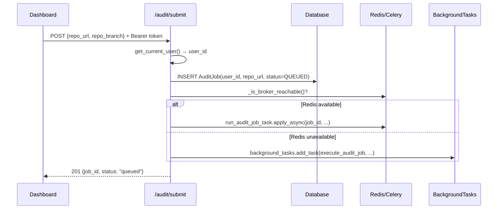
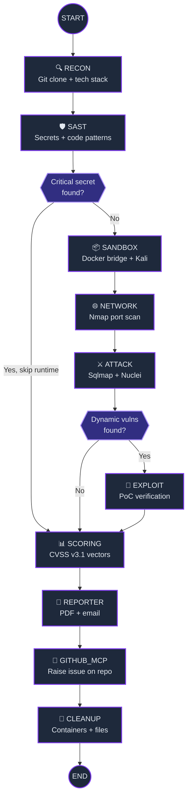
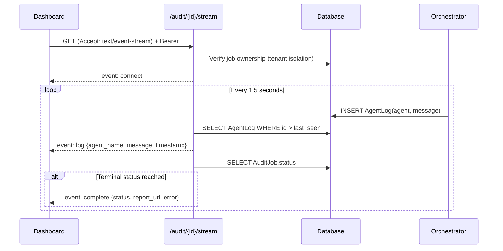
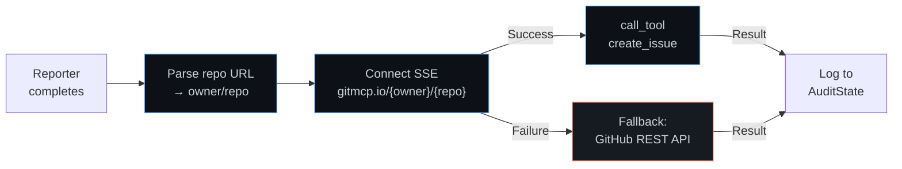
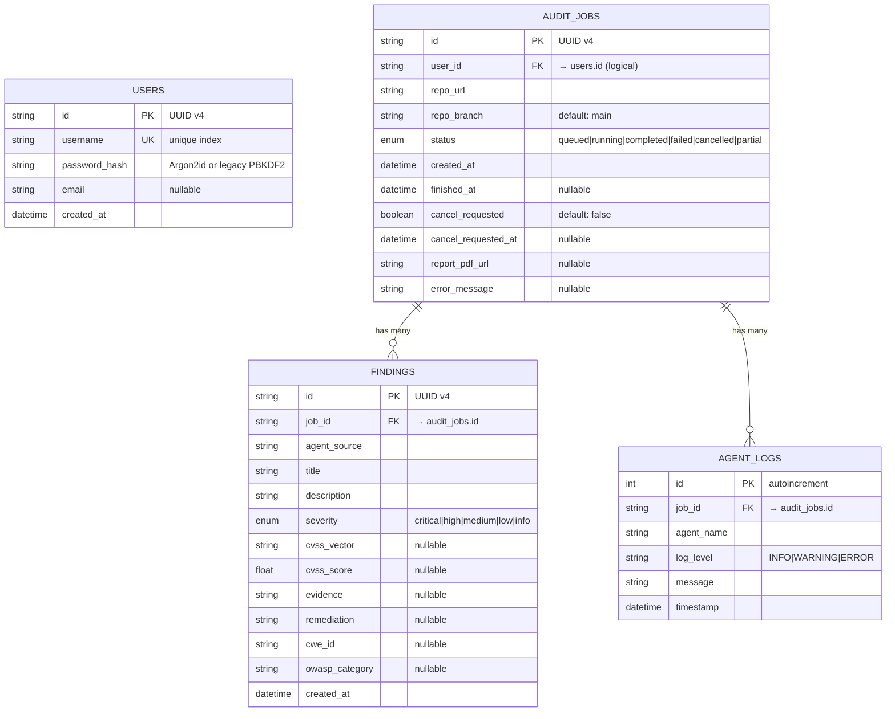

# Historical Note

Prefer `docs/DATA_FLOW_AND_STORAGE.md` and `docs/ORCHESTRATION_PIPELINE.md` for current behavior. This file is older design/reference material.

# Fire Crow — Complete Architecture Audit & Data Flow

> Generated: 2026-06-05 · Covers backend, frontend, orchestrator, agents, services, models, and API surface.

---

## 1. Project Layout

```
Fire Crow/
├── backend/
│   ├── app/
│   │   ├── agents/           # Security scanning agent modules
│   │   │   ├── recon.py          → Git clone + tech stack detection
│   │   │   ├── sast.py           → Static secrets + unsafe code regex scanning
│   │   │   ├── network.py        → Nmap port/service scanning (in Kali container)
│   │   │   ├── attack.py         → Sqlmap + Nuclei active vulnerability scanning
│   │   │   ├── exploit.py        → PoC exploit verification (SQL dump, RCE)
│   │   │   └── github_mcp.py     → GitMCP SSE client for issue/PR creation
│   │   ├── api/              # FastAPI route handlers
│   │   │   ├── routes_auth.py    → /auth/login, /auth/register, /auth/me
│   │   │   ├── routes_audit.py   → /audit/submit, /audit/jobs, /audit/job/{id}
│   │   │   ├── routes_sse.py     → /audit/{job_id}/stream (SSE log stream)
│   │   │   ├── routes_system.py  → /system/status (health + agent manifest)
│   │   │   └── audit_queries.py  → Tenant-scoped query helper
│   │   ├── models/           # SQLAlchemy 2.0 ORM models
│   │   │   ├── database.py       → Engine init, PostgreSQL→SQLite fallback
│   │   │   ├── audit_job.py      → AuditJob, FindingModel, AgentLog tables
│   │   │   └── user.py           → User table (Argon2id password hashes, legacy PBKDF2 compatibility)
│   │   ├── orchestrator/     # LangGraph state machine
│   │   │   ├── maestro.py        → Graph definition, 10 phase nodes, routing
│   │   │   ├── runtime.py        → Job execution loop + terminal state persistence
│   │   │   └── runtime_context.py→ ContextVar tracker for cross-node state
│   │   ├── schemas/          # Pydantic models
│   │   │   ├── audit_state.py    → AuditState (LangGraph state), Finding, enums
│   │   │   └── audit_api.py      → API request/response schemas
│   │   ├── services/         # Business logic services
│   │   │   ├── auth.py           → JWT encode/decode, Argon2id hash/verify, token revocation
│   │   │   ├── reporter.py       → HTML→PDF (WeasyPrint), DB-backed report persistence, Resend email
│   │   │   └── sandbox.py        → Docker bridge network + Kali container manager
│   │   ├── workers/
│   │   │   └── celery_app.py     → Celery task definition (Redis broker)
│   │   ├── config.py         → Pydantic Settings (env vars, production validator)
│   │   └── main.py           → FastAPI app factory, CORS, router mounting
│   ├── tests/                # pytest suite (29 tests)
│   └── requirements.txt
├── frontend/                 # Next.js 14 (App Router)
│   └── src/app/
│       ├── page.tsx              → Public landing page
│       ├── signin/page.tsx       → Auth form (workspace + password)
│       ├── dashboard/page.tsx    → Operations console (SSE, jobs, findings)
│       ├── terms/page.tsx        → Legal terms
│       ├── layout.tsx            → Root layout (DM Sans, JetBrains Mono, Rajdhani)
│       └── globals.css           → Design system tokens (20KB)
├── docs/
│   └── agen.md               → Implementation blueprint
├── workspace/                # Runtime artifacts (scans/, reports/)
└── firecrow.db               → SQLite database (dev default)
```

---

## 2. Technology Stack

| Layer | Technology | Purpose |
|:------|:-----------|:--------|
| **API Server** | FastAPI 0.110+ | Async HTTP endpoints, dependency injection |
| **Orchestrator** | LangGraph (StateGraph) | Directed acyclic graph for agent phase routing |
| **Task Queue** | Celery 5.3 + Redis | Background job dispatch (fallback: FastAPI BackgroundTasks) |
| **Database** | PostgreSQL (prod) / SQLite (dev) | Job, finding, log, user persistence |
| **ORM** | SQLAlchemy 2.0 (mapped_column) | Declarative models with type-safe columns |
| **Auth** | PyJWT + Argon2id | Bearer/cookie auth, salted password hashing, token revocation |
| **Sandbox** | Docker SDK (Python) | Private bridge networks, controlled scanner + target containers |
| **PDF Reports** | WeasyPrint | HTML→PDF compilation |
| **Report Storage** | Neon PostgreSQL + local workspace overflow | HTML/JSONB artifact persistence with authenticated download route |
| **Email** | Resend API | Transactional audit completion emails |
| **GitHub Integration** | GitMCP (gitmcp.io SSE) + REST API | Auto-raise security issues on scanned repos |
| **Frontend** | Next.js 14, React 18, TypeScript | App Router SSR + client dashboard |
| **Config** | Pydantic Settings v2 | Env file cascading with validation |

---

## 3. Data Flow — End-to-End Audit Lifecycle

### 3.1 Authentication Flow



### 3.2 Job Submission & Dispatch



### 3.3 Orchestrator Pipeline (LangGraph)



**State propagation**: Every node reads from and writes to a shared `AuditState` Pydantic model. List fields (findings, ports, errors) use `operator.add` annotation so LangGraph merges them additively across nodes. A `ContextVar`-based `RuntimeTracker` holds the cumulative state across the graph invocation for thread-safe access.

### 3.4 Phase-by-Phase Data Mutations

| Phase | Reads From State | Writes To State |
|:------|:-----------------|:----------------|
| **RECON** | `repo_url`, `repo_branch` | `clone_path`, `tech_stack`, `entry_points`, `dependency_manifests` |
| **SAST** | `clone_path`, `repo_url` | `static_findings[]` |
| **SANDBOX** | `job_id`, `clone_path`, `entry_points` | `sandbox_container_id`, `sandbox_target_ip`, `sandbox_ready` |
| **NETWORK** | `sandbox_container_id`, `sandbox_target_ip`, `tech_stack` | `open_ports[]`, `api_endpoints[]` |
| **ATTACK** | `sandbox_container_id`, `sandbox_target_ip`, `open_ports`, `repo_url` | `dynamic_findings[]` |
| **EXPLOIT** | `sandbox_container_id`, `sandbox_target_ip`, `dynamic_findings` | `exploit_proofs[]` |
| **SCORING** | `job_id` (reads FindingModel from DB) | `scored_findings[]`, `risk_summary` |
| **REPORTER** | `job_id`, `repo_url`, all findings lists | `report_pdf_url`, `report_delivered`, `status` |
| **GITHUB_MCP** | `job_id`, `repo_url`, all findings lists | `github_issue_created`, `github_pr_created`, `github_mcp_logs[]` |
| **CLEANUP** | `job_id`, `clone_path`, `sandbox_container_id` | *(removes temp files + containers)* |

### 3.5 SSE Streaming Flow



### 3.6 GitHub MCP Integration Flow



---

## 4. Database Schema

### 4.1 Entity Relationship Diagram



### 4.2 Database Initialization

- **Production**: PostgreSQL via `DATABASE_URL` env var
- **Development**: Auto-fallback to SQLite (`firecrow.db`) only when `DEBUG=true`
- **Schema creation**: `Base.metadata.create_all()` remains a compatibility check; production deployments should run Alembic migrations before startup
- **Migration compat**: compatibility hooks add missing audit/user columns and attempt a non-destructive lower(email) unique index

---

## 5. API Surface

### 5.1 Endpoints

| Method | Path | Auth | Description |
|:-------|:-----|:----:|:------------|
| `POST` | `/api/v1/auth/register` | ✗ | Create new workspace user |
| `POST` | `/api/v1/auth/login` | ✗ | Authenticate and get JWT |
| `GET` | `/api/v1/auth/me` | ✓ | Current user details |
| `POST` | `/api/v1/audit/submit` | ✓ | Submit repo for security audit |
| `GET` | `/api/v1/audit/jobs` | ✓ | List user's jobs (tenant-scoped) |
| `GET` | `/api/v1/audit/job/{id}` | ✓ | Job detail + findings |
| `DELETE` | `/api/v1/audit/job/{id}` | ✓ | Request job cancellation |
| `GET` | `/api/v1/audit/{id}/stream` | ✓ | SSE live log stream |
| `GET` | `/api/v1/system/status` | ✓ | Tenant-scoped readiness, stats, and agent manifest |
| `GET` | `/health` | ✗ | DB connection check |
| `GET` | `/` | ✗ | API root status |
| `GET` | `/api/v1/audit/job/{id}/report` | ✓ | Authenticated report download/allowed storage redirect |

### 5.2 Authentication

- **Scheme**: HTTP Bearer (`Authorization: Bearer <jwt>`)
- **Browser OAuth session**: HTTP-only `fc_access_token` cookie with `SameSite=Lax`
- **Token payload**: `{sub, username, exp, iat, nbf, jti, iss, aud}`
- **Algorithm**: HS256 with `SECRET_KEY` from env
- **Expiry**: 24 hours
- **Password storage**: Argon2id. Legacy PBKDF2-HMAC-SHA256 hashes still verify and are rehashed after successful login.

### 5.3 Tenant Isolation

Every data query in `routes_audit.py` and `routes_sse.py` filters by `user_id` from the JWT. The helper `get_owned_job_or_404()` enforces `AuditJob.user_id == current_user` before any read/write.

---

## 6. Configuration & Environment

### 6.1 Settings Cascade

Pydantic Settings reads from (in priority order):
1. OS environment variables
2. `{workspace}/.env`
3. `backend/.env`
4. `{workspace}/.env.local`
5. `backend/.env.local`

### 6.2 Environment Variables

| Variable | Default | Purpose |
|:---------|:--------|:--------|
| `PORT` | `8000` | Uvicorn listen port |
| `DEBUG` | `false` | Enables local-only dev conveniences when explicitly set true |
| `SECRET_KEY` | `""` | JWT signing key (**required in prod, minimum 32 chars**) |
| `DATABASE_URL` | `postgresql://...` | Primary database (SQLite only allowed with DEBUG=true) |
| `REDIS_URL` | `redis://localhost:6379/0` | Celery broker + result backend |
| `FIRE_CROW_MOCK_SANDBOX` | `false` | Use simulated Docker containers in DEBUG only |
| `FIRE_CROW_ALLOW_UNTRUSTED_DOCKERFILE_BUILD` | `false` | Explicit opt-in for user Dockerfile builds |
| `FIRE_CROW_SCANNER_IMAGE` | pinned image tag | Controlled scanner runtime image; `:latest` is rejected in prod |
| `GITHUB_CLIENT_ID` | `""` | GitHub OAuth client ID |
| `GITHUB_CLIENT_SECRET` | `""` | GitHub OAuth client secret |
| `GITHUB_TOKEN` | `""` | PAT for GitMCP issue/PR creation |
| `RESEND_API_KEY` | `""` | Transactional email API key |
| `GEMINI_API_KEY` | `""` | Google Gemini model key |
| `OPENAI_API_KEY` | `""` | OpenAI model key |

### 6.3 Production Validator

A `@model_validator` on `Settings` raises `ValueError` at startup if production configuration is missing a strong `SECRET_KEY`, uses SQLite, or configures a `:latest` scanner image.

---

## 7. Agent Detail

### 7.1 RECON (`agents/recon.py`)

- **Input**: `repo_url`, `repo_branch`
- **Process**: `git clone --depth 1 --branch {branch} -- {url} {dir}` via subprocess (60s timeout)
- **Security**: Rejects URLs/branches starting with `-` (argument injection prevention), uses `--` separator
- **Output**: `clone_path`, `tech_stack[]`, `entry_points[]`, `dependency_manifests[]`
- **Detection**: Walks filesystem for `package.json`, `requirements.txt`, `Dockerfile`, etc.

### 7.2 SAST (`agents/sast.py`)

- **Secrets Scanner**: 4 regex signatures (GitHub tokens, AWS keys, generic passwords)
- **Code Scanner**: 6 patterns (eval, exec, SQL injection via f-string/%, subprocess shell=True)
- **File walk**: Skips `.git`, `node_modules`, `.venv`, binary files
- **Output**: `Finding[]` with severity, CWE ID, evidence (redacted secrets), remediation

### 7.3 SANDBOX (`services/sandbox.py`)

- **Mock mode**: Returns simulated container IDs and IPs only when `DEBUG=true`
- **Live mode**: Creates Docker bridge network (`fc-net-{job_id}`), starts target container using a controlled runtime by default, and starts the pinned `FIRE_CROW_SCANNER_IMAGE`
- **Dockerfile builds**: User-provided Dockerfiles are disabled by default and require `FIRE_CROW_ALLOW_UNTRUSTED_DOCKERFILE_BUILD=true`
- **Cleanup**: Stops/removes both containers and the bridge network

### 7.4 NETWORK (`agents/network.py`)

- **Tool**: Nmap `-sV -p 80,443,3000,5000,8000,8080` inside Kali container
- **Output**: Parsed list of `{port, service, version}` dicts

### 7.5 ATTACK (`agents/attack.py`)

- **Tools**: Sqlmap (batch mode, crawl+forms) and Nuclei (medium/high/critical severity filter)
- **Output**: `Finding[]` for confirmed SQL injection and CVE matches

### 7.6 EXPLOIT (`agents/exploit.py`)

- **Validates**: SQL injection (runs `sqlmap --dbs` for schema dump proof) and RCE (runs `curl` with `cmd=id`)
- **Output**: `Finding[]` with exploitation evidence strings

### 7.7 SCORING (`maestro.py:scoring_body`)

- **Source**: Reads `FindingModel` rows from database
- **Logic**: Maps severity → CVSS score (Critical=9.8, High=8.5, Medium=5.0) and assigns CVSS v3.1 vectors
- **Output**: `scored_findings[]`, `risk_summary{cve_count, max_cvss_score, average_risk_rating}`

### 7.8 REPORTER (`services/reporter.py`)

- **HTML**: Generates premium styled executive audit report with severity badges, evidence blocks, and summary table
- **PDF**: Compiles via WeasyPrint. Simulated PDF fallback is DEBUG-only.
- **Persistence**: Reports are stored in Neon PostgreSQL, with temporary PDFs generated only for delivery workflows.
- **Email**: Sends via configured providers. Local HTML fallback is DEBUG-only.

### 7.9 GITHUB_MCP (`agents/github_mcp.py`)

- **URL parsing**: Regex extraction of `owner/repo` from GitHub URLs (HTTPS and SSH)
- **GitMCP SSE**: Connects to `gitmcp.io/{owner}/{repo}`, discovers write endpoint, invokes `create_issue` tool
- **Fallback**: Direct GitHub REST API `POST /repos/{owner}/{repo}/issues`
- **Mock mode**: Simulates issue creation in DEBUG mode
- **Report format**: Markdown with severity emojis, CWE badges, evidence blocks, and remediation plans

### 7.10 CLEANUP (`maestro.py:cleanup_body`)

- Calls `SandboxManager.cleanup_sandbox()` to destroy containers and network
- Removes `clone_path` directory via `shutil.rmtree()`
- Marks `RuntimeTracker.cleanup_completed = True`

---

## 8. Frontend Architecture

### 8.1 Pages

| Route | Component | Description |
|:------|:----------|:------------|
| `/` | `page.tsx` | Public landing with pipeline preview, feature pillars |
| `/signin` | `signin/page.tsx` | Workspace name + password form, terms checkbox |
| `/dashboard` | `dashboard/page.tsx` | Full operations console (779 lines) |
| `/terms` | `terms/page.tsx` | Legal terms and conditions |

### 8.2 Dashboard Sections

- **Operations**: Job submission form, job history table with status badges, cancel button
- **Reports**: Job detail view with findings table (severity, CVSS, evidence, remediation)
- **Agents**: System status display showing all 10 registered agents
- **Settings**: Placeholder configuration panel

### 8.3 Real-time Features

- **SSE Stream**: Custom `fetch`-based SSE parser with JWT `Authorization` header
- **Polling**: Status refresh every 3.5 seconds (redundant with SSE — noted for optimization)
- **Pipeline Stepper**: 9-step visual progress indicator mapped to phase names

### 8.4 Design System

- **Fonts**: DM Sans (body), JetBrains Mono (code), Rajdhani (display headings)
- **Theme**: Obsidian dark mode, glassmorphic cards, neon accent glows
- **CSS**: 20KB `globals.css` with design tokens, severity badge colors, terminal styling

---

## 9. Routing Logic (Conditional Edges)

### `route_after_sast`
```python
# If a CRITICAL finding with "secret" in title → skip sandbox entirely → go to SCORING
for finding in state.static_findings:
    if finding.severity == CRITICAL and "secret" in finding.title.lower():
        return "scoring"
return "sandbox"
```

### `route_after_attack`
```python
# If no dynamic findings → skip exploit verification → go to SCORING
if len(state.dynamic_findings) == 0:
    return "scoring"
return "exploit"
```

---

## 10. Error Handling & Cancellation

### 10.1 Cancellation Protocol

1. User sends `DELETE /audit/job/{id}`
2. API sets `cancel_requested=True` + `cancel_requested_at` on AuditJob
3. API calls `celery_app.control.revoke(job_id, terminate=True, signal="SIGTERM")`
4. Each `execute_phase()` checks `cancel_requested` before and after the phase body
5. If found, raises `JobCancellationRequested` → finalizes with `CANCELLED` status
6. Cleanup phase runs regardless (`check_cancel_before=False`)

### 10.2 Terminal Status Resolution

```
Has cancel_requested?           → CANCELLED
Exception is cancellation?      → CANCELLED
No exception?                   → COMPLETED (or state.status if already COMPLETED/PARTIAL)
Exception + partial output?     → PARTIAL
Exception + no output?          → FAILED
```

### 10.3 Partial Output Detection

A job is marked `PARTIAL` instead of `FAILED` if any of these exist:
- `report_pdf_url` is set
- `static_findings` is non-empty
- `dynamic_findings` is non-empty
- `exploit_proofs` is non-empty
- Any `FindingModel` row exists in DB for the job

---

## 11. Security Posture

| Control | Status | Implementation |
|:--------|:------:|:---------------|
| Password hashing | ✅ | Argon2id with legacy PBKDF2 verification and rehash |
| JWT authentication | ✅ | HS256, 24h expiry, issuer/audience/jti claims, logout revocation |
| Production key validation | ✅ | Startup error if SECRET_KEY/DB/scanner image config is unsafe for DEBUG=false |
| Tenant isolation | ✅ | All queries filter by user_id from JWT |
| Git argument injection | ✅ | Prefix check + `--` separator in subprocess |
| Celery termination | ✅ | `terminate=True, signal="SIGTERM"` on cancel |
| Sandbox network isolation | ✅ | Private Docker bridge, no host network access |
| CORS | ✅ | Explicit configured origins with credentials |
| Rate limiting | ✅ | SlowAPI route limits plus per-IP/username login failure throttling |
| Budget enforcement | ❌ | `budget_remaining_usd` field exists but not checked |
| Scan duration limits | ❌ | `max_scan_duration_sec` field exists but not enforced |
| Regex ReDoS protection | ✅ | File size and line length bounds on regex SAST scan targets |

---

## 12. Test Coverage

```
backend/tests/
├── test_agents.py       (6 tests)  → recon mock, tech detection, secrets, unsafe code, github_mcp
├── test_audit_routes.py (8 tests)  → submit, list, detail, cancel, tenant isolation
├── test_auth.py         (4 tests)  → login, register, password verification, /me
├── test_config.py       (1 test)   → production SECRET_KEY validation
├── test_maestro.py      (3 tests)  → default path, secrets-leak skip, vuln-exploit path
├── test_runtime.py      (5 tests)  → lifecycle, cancellation, cleanup, partial status
└── test_schemas.py      (2 tests)  → AuditState serialization, Finding model
                         ─────────
                         29 tests total, all passing
```

---

## 13. Deployment Modes

### Local Development
```
DEBUG=true → SQLite fallback, auto-create users, mock sandbox, BackgroundTasks fallback
```

### Production
```
DEBUG=false → PostgreSQL required, explicit user registration, Docker sandbox,
              Celery+Redis required, SECRET_KEY must be changed
```

### Integration Readiness

| Service | Required For | Fallback |
|:--------|:-------------|:---------|
| PostgreSQL | Data persistence | SQLite file |
| Redis | Celery task queue | FastAPI BackgroundTasks (in-process) |
| Docker | Kali sandbox | Simulated mock responses |
| WeasyPrint (GTK libs) | PDF reports | Simulated PDF stub |
| External object storage | Not required | Authenticated local report download endpoint |
| Resend | Email delivery | Skipped silently |
| GitHub Token | Issue creation | Skipped with warning log |

## Fallback Automation
If the AI Analyzer fails or is not configured, the `ai_analyzer_body` routes to a deterministic fallback module (`fallback_writer.py`). This module guarantees that an executive summary, remediation tasks, email bodies, and PR remediation plans are generated even without AI assistance.

---
*Documentation last updated: June 08, 2026*
