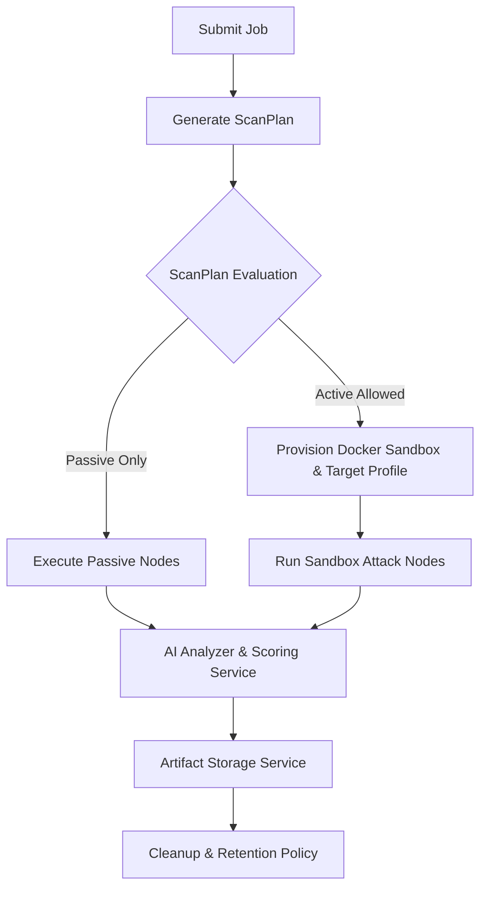

# Historical Note

Prefer `docs/ORCHESTRATION_PIPELINE.md` for the current pipeline. This file is roadmap material, not the current repository source of truth.

# Backend Orchestration Refactor & Hardening Roadmap

This roadmap outlines the systematic plan to audit, refactor, and harden the core backend, orchestration logic, and persistence pipelines of Fire Crow (FCv1).

---

## 1. Current State Assessment

### Current Graph Flow
- The orchestrator employs a `StateGraph` (defined in `maestro.py`) containing nodes for `recon`, `api_surface`, `secret_history`, `dependency`, `sbom_graph`, `iac`, `cicd_scan`, `container_scan`, `sast`, `semgrep`, `authz_idor`, `sandbox`, `network`, `attack`, `exploit`, `ai_analyzer`, `scoring`, `attack_graph`, `remediation_planner`, `reporter`, `github_mcp`, `google_agent`, and `cleanup`.
- A conditional edge routes from `authz_idor` to either `ai_analyzer` or `sandbox` based on static/semgrep findings (checking for critical secrets).
- Another conditional edge routes from `attack` to `exploit` or `ai_analyzer` based on the existence of dynamic findings.

### Current Persistence Flow
- Findings are persisted via `persist_findings` (writing `FindingModel` directly to PostgreSQL) immediately after execution of each node.
- Raw evidence (potentially large) is stored inline in the `evidence` field.
- A basic deduplication helper (`_dedupe_findings`) is used.

### Current Report/Artifact Flow
- HTML reports are stored directly in `audit_reports`.
- The authenticated backend report endpoint is written as canonical job state in `AuditJob.report_pdf_url`.

### Current Failure/Cancel/Cleanup Behavior
- Cancellation checks (`check_cancel_requested`) are performed before and after each phase execution.
- If cancelled, resource cleanup runs.
- Cleanup is scoped to local workspace resources for the current job.

### Current Scanner Capability Model
- The orchestrator assumes capability availability (e.g. nmap, docker, semgrep) based on whether it is running in mock mode or not, without checking if those binaries are actually installed on the system.

### Current Hardcoded Values
- Active jobs limit per user (currently `MAX_ACTIVE_JOBS_PER_USER = 3` in `routes_audit.py`).
- Server ports and sandbox config values (`python:3.12-alpine` and `python -m http.server 8000`).
- AI model fallbacks and prompt limits.
- Scoring rules (e.g., critical = 9.8, high = 8.5, medium/low = 5.0).
- Network surface discovery targets.

---

## 2. Target Architecture

### Core Design Rules
1. **Zero Hardcoded Business Limits**: Define all tunables in `backend/app/config.py`.
2. **Deterministic Scan Planning**: A dedicated `ScanPlan` verifies repo characteristics, agent capabilities, and attestation status before graph invocation.
3. **Robust State Merging**: Extract list fields dynamically from Pydantic `AuditState` annotations containing `operator.add` metadata.
4. **Persisted Phase Ledger**: Record the outcome and capability mode of each node execution in a database table.
5. **Secure Private Artifact Retrieval**: Keep report delivery on authenticated backend endpoints instead of storing public links in the database.
6. **No Dangerous Sweeps**: Deprecate global bucket cleanup from normal job flows in favor of scoped retention cycles.

---

## 3. Detailed Refactoring Map

- **Phase 2**: Relocate limits, timeouts, and URLs to `config.py`. Update model parameters and sandbox commands.
- **Phase 3**: Create `scan_plan.py` to evaluate repo types, launch configurations, capability checks, and active-attack attestations.
- **Phase 4**: Refactor `runtime_context.py` to dynamically inspect `AuditState.model_fields` to find `operator.add` metadata and build the additive fields set.
- **Phase 5**: Create the persisted phase ledger schema and transition jobs to completed, partial, or failed statuses based on phase status.
- **Phase 6**: Update `FindingModel` persistence to automatically redact evidence and offload large evidence fields into the artifact storage service.
- **Phase 7**: Continue consolidating artifact persistence so database-backed reports and evidence remain the default production path.
- **Phase 8**: Refactor cleanup logic to invoke the new `retention.py` service.
- **Phase 9**: Integrate active sandbox checks with user authorization attestations.
- **Phase 10**: Create a scanner registry config parser (`scanners.yaml` or `.json` / capability checker).
- **Phase 11**: Define sandbox target application launch profiles.
- **Phase 12**: Harden the AI analyzer against timeouts and graceful fallback logic.
- **Phase 13**: Refactor scoring to a deterministic service (`scoring.py`).
- **Phase 14**: Implement endpoint discovery using framework route parsing.
- **Phase 15**: Ensure cancellations terminate scanner subprocesses and docker networks safely.
- **Phase 16**: Standardize SSE outputs with proper scopes.
- **Phase 17**: Write Alembic migrations for new tables (ledger, indexes).
- **Phase 18**: Write comprehensive unit tests for each refactored component.
- **Phase 19**: Run verification and ensure system integrity.

---
*Documentation last updated: June 08, 2026*
