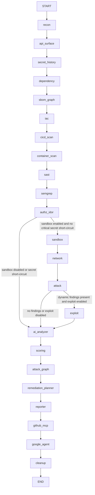

# Orchestration Pipeline

The current pipeline is defined in `backend/app/orchestrator/maestro.py`. It is not the older "7-stage" graph described by stale docs.

## Exact Node Order

The graph is compiled in this order:

1. `recon`
2. `api_surface`
3. `secret_history`
4. `dependency`
5. `sbom_graph`
6. `iac`
7. `cicd_scan`
8. `container_scan`
9. `sast`
10. `semgrep`
11. `authz_idor`
12. conditional route to `sandbox` or `ai_analyzer`
13. `sandbox`
14. `network`
15. `attack`
16. conditional route to `exploit` or `ai_analyzer`
17. `exploit`
18. `ai_analyzer`
19. `scoring`
20. `attack_graph`
21. `remediation_planner`
22. `reporter`
23. `github_mcp`
24. `google_agent`
25. `cleanup`

## Graph Diagram

## Conditional Routes

Source: `route_after_semgrep()` and `route_after_attack()` in `backend/app/orchestrator/maestro.py`.

### After `authz_idor`

The graph skips active stages and jumps to `ai_analyzer` when either:

- `scan_plan.enabled_scanners` does not include `sandbox`, or
- any `static_findings` or `semgrep_findings` entry is `critical` and has `secret` in its title.

Otherwise it enters `sandbox`.

### After `attack`

The graph jumps directly to `ai_analyzer` when either:

- `scan_plan.enabled_scanners` does not include `exploit`, or
- `dynamic_findings` is empty.

Otherwise it enters `exploit`.

## What Each Phase Reads And Writes

Source: phase bodies in `backend/app/orchestrator/maestro.py` plus helpers in `backend/app/agents/*` and `backend/app/services/*`.

| Phase | Reads | Writes |
| --- | --- | --- |
| `recon` | repo URL, branch, optional GitHub token | clone path, tech stack, entry points, manifests, scan plan |
| `api_surface` | clone path | detected routes, route risk summary |
| `secret_history` | clone path | secret findings |
| `dependency` | clone path, manifests | dependency findings, scanner execution metadata |
| `sbom_graph` | clone path | SBOM component list, dependency graph summary |
| `iac` | clone path | IaC findings |
| `cicd_scan` | clone path | CI/CD findings |
| `container_scan` | clone path | container findings |
| `sast` | clone path, repo URL | static findings |
| `semgrep` | clone path, tech stack | semgrep findings, scanner execution metadata |
| `authz_idor` | detected API surface | authz findings |
| `sandbox` | clone path, entry points, sandbox settings | sandbox IDs, target IP, sandbox execution metadata |
| `network` | sandbox IDs and target IP, API surface | open ports, API endpoints, scanner execution metadata |
| `attack` | sandbox IDs, target IP, open ports | dynamic findings, scanner execution metadata |
| `exploit` | sandbox IDs, target IP, dynamic findings | exploit proof findings |
| `ai_analyzer` | accumulated findings | deduplicated findings, false positives, chains, remediations |
| `scoring` | persisted findings | CVSS fields, risk summary |
| `attack_graph` | routes plus selected findings | attack graph, attack chains |
| `remediation_planner` | selected findings | remediation plan and remediation tasks |
| `reporter` | reportable findings, scanner execution | report stored in audit_reports table, HTML snapshot, completed status |
| `github_mcp` | findings, remediations, optional token | GitHub issue/PR metadata |
| `google_agent` | findings, remediations, recipient email | PR risk report, email-delivery metadata |
| `cleanup` | clone path, sandbox identifiers | no new business state, marks cleanup complete |

## Passive vs Active Phases

Passive / repository-only phases:

- `recon`
- `api_surface`
- `secret_history`
- `dependency`
- `sbom_graph`
- `iac`
- `cicd_scan`
- `container_scan`
- `sast`
- `semgrep`
- `authz_idor`
- `ai_analyzer`
- `scoring`
- `attack_graph`
- `remediation_planner`

Active / sandbox-targeting phases:

- `sandbox`
- `network`
- `attack`
- `exploit`

Outbound integration phases:

- `reporter`
- `github_mcp`
- `google_agent`

## Sandbox Dependence

Source: `backend/app/orchestrator/scan_plan.py`, `backend/app/services/sandbox.py`.

Active testing is enabled only when all of these are true:

- attestation is accepted
- `authorization_scope == "full_active"`
- Docker is available
- the target repo looks like a supported Python or Node launch profile

In debug mode, sandbox provisioning can fall back to simulation when Docker is unavailable.

## Failure Policy

Source: `NON_CRITICAL_PHASES` in `backend/app/orchestrator/maestro.py`.

Non-critical phases degrade the job to `partial` on exception and allow later phases to continue. That set currently includes:

- `api_surface`
- `secret_history`
- `dependency_scan`
- `sbom_graph`
- `iac_scan`
- `cicd_scan`
- `container_scan`
- `semgrep_scan`
- `authz_idor`
- `sandbox`
- `network`
- `attack`
- `exploit`
- `github_mcp`
- `google_agent`

Phases outside that list can still fail the orchestration.

## Cleanup Behavior

Source: `cleanup_resources()` in `backend/app/orchestrator/maestro.py` and finalization in `backend/app/orchestrator/runtime.py`.

- Tries to remove the sandbox network, target container, and Kali container.
- Deletes the cloned repository workspace.
- If the graph never reaches `cleanup`, `runtime.py` still forces cleanup in `finally`.

## Cancellation Behavior

Source: `check_cancel_requested()` in `backend/app/orchestrator/maestro.py`, `routes_audit.py`, and `runtime.py`.

- `DELETE /api/v1/audit/job/{job_id}` sets `cancel_requested` and writes an audit log entry.
- The orchestrator checks for cancellation before and after most phases.
- Cancellation raises `JobCancellationRequested`, triggers cleanup, and finalizes the job as `cancelled`.

## Degraded And Simulated Behavior

- `dependency_scan.py` simulates findings in debug mode when scanners are unavailable.
- `sast_semgrep.py` simulates findings in debug mode when `semgrep` is unavailable.
- `sandbox.py` simulates sandbox resources in debug mode when Docker is unavailable or `FIRE_CROW_MOCK_SANDBOX=true`.
- `attack.py` and `exploit.py` mark some findings as `[SIMULATED]` when running in mock sandbox mode.
- `ai_analyzer.py`, `github_mcp.py`, and `google_agent.py` all have debug fallback behavior.
- `reporter.py` can emit HTML plus a placeholder PDF when WeasyPrint is unavailable.

## Known Risks And TODOs

- The frontend submit flow does not currently provide the attestation fields required by the backend.
- `scheduler.py` is still placeholder infrastructure, not a real scheduled-audit subsystem.
- The current scoring phase uses a simple severity-to-CVSS mapping rather than scanner-native scoring.

---
*Documentation last updated: June 08, 2026*
