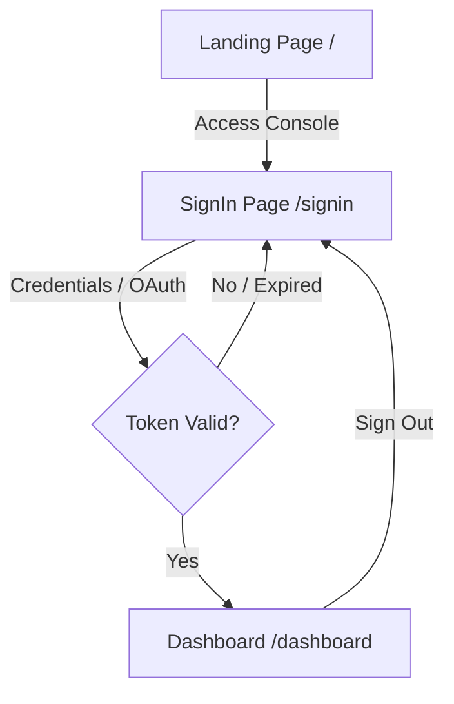

# Fire Crow UI & Component Specification

This document details the UI design tokens, page layout hierarchy, interactive states, and page routing logic for the Fire Crow web dashboard.

---

## 1. Design System & Tokens

Fire Crow uses custom CSS properties declared in [frontend/src/app/globals.css](file:///d:/Fire%20Crow/frontend/src/app/globals.css) to build a glassmorphic dark-cyberpunk aesthetic. 

### 1.1 Color Palette
* **Deep Space Background**: `--bg` (`#050609`)
* **Surfaces**: `--surface` (`#0b0d18`), `--surface-alt` (`#0f1120`)
* **Borders & Brightness**: `--border` (`#151826`), `--bright` (`#22253c`)
* **Theme Accent Color (Fire)**: `--fire` (`#ff4500`)
* **Warning & Alerts**:
  * Critical Severity: `--red` (`#ff3047`)
  * High Severity: `--orange` (`#ff7200`)
  * Medium Severity: `--amber` (`#ffb800`)
  * Low Severity: `--blue` (`#5cc8ff`)
  * Informational: `--purple` (`#b197fc`)
  * Success/Online: `--green` (`#00e676`)
* **Typography Colors**: `--text` (`#dee1f5`), `--dim` (`#8890b5`), `--muted` (`#484a6a`)

### 1.2 Layout Dimensions
* **Sidebar Navigation Width**: `280px`
* **Grid Layouts**: Shell is divided as `grid-template-columns: 280px minmax(0, 1fr)`.
* **Card Corner Roundness**: `8px` (`--card-radius`)

---

## 2. Page Hierarchy & Flow

### 2.1 Landing Page (`/`)
* **UX Objective**: High-end landing page highlighting agent capabilities.
* **Layout Structure**:
  * **Header**: Logo and a glowing "Open Console" action button.
  * **Hero Section**: Neon background gradients, headline showing vulnerability scan capabilities, and a mock interactive visual terminal scanning process.
  * **Feature Blocks**: Core grids listing agent nodes (Maestro, Recon, Sandbox, Exploit).
  * **Footer**: Detailed site footer with legal links, GitHub code access, and version indicators.

### 2.2 Sign-In & Onboarding (`/signin`)
* **UX Objective**: Securely authenticate the user workspace.
* **Layout Structure**:
  * Glassmorphic login box centered on the screen.
  * Inputs for Workspace ID and Password.
  * Terms & Conditions agreement checkbox.
  * Google and GitHub OAuth social buttons.
  * Action button containing a subtle loader spinner state during submission.

### 2.3 Dashboard Workspace (`/dashboard`)
* **UX Objective**: Central control room for security execution.
* **Layout Structure**:
  * **Sidebar**: Workspace profile banner, 4 navigation buttons (`Operations`, `Reports`, `Agents`, `Settings`), and a "Sign Out" button.
  * **Operations Panel**:
    * Trigger panel (URL & branch input) to launch audits.
    * Active Audit progress bar showing PIPELINE steps.
    * Real-time streaming CLI console mirroring agent activity.
    * Vulnerability table filtering findings by severity level.
  * **Reports Panel**:
    * Table displaying historic audits.
    * Action button to trigger instant PDF generation and download.
  * **Agents Panel**:
    * Node checklist displaying currently registered agents and active system check statuses.
  * **Settings Panel**:
    * Displays API credentials, debug flags, sandbox execution details, and status indicators for system databases.

---

## 3. Client-Side Authentication Handling

### 3.1 Protected Route Guards
All requests to `/dashboard` verify user session keys on load:

1. **Check Keys**: If `fc_token` or `fc_terms_accepted` are absent, the application immediately redirects the browser to `/signin`.
2. **Session Verification**: The application triggers a verification call to `/api/v1/auth/me` with Bearer auth headers.
3. **Invalid Token**: If the request returns a status code `401 Unauthorized` or fails, the client clears the local storage and returns the user to the log-in page.

### 3.2 Token Expiration
If a fetch request returns a status `401` during active usage:
* A notification banner warns the user of session expiration.
* Local storage is cleaned automatically.
* The application routes the user to `/signin` with an optional query parameter indicating the session expired.

---
*Documentation last updated: June 08, 2026*
