# Fire Crow (FCv1) — Step-by-Step Implementation Blueprint

This guide maps out the implementation of **Fire Crow (FCv1)**, a security intelligence platform that audits repositories using autonomous agents. This plan prioritizes **understandability**—explaining the *why*, *what*, and *how* behind each component so that any engineer can follow, build, and extend it.

---

## 1. Core Concepts Explained

Before looking at the code, let's clarify the key concepts that drive Fire Crow:

* **Maestro (The Orchestrator)**: Think of Maestro as the air traffic controller. It doesn't run scans directly. Instead, it reads the current state, decides which security agent should run next, triggers that agent, waits for it to finish, and collects its findings.
* **AuditState (The Clipboard)**: A single shared memory object (a Python dataclass) that travels from node to node. When the RECON agent finishes cloning the repo, it writes the path to this clipboard. When the SAST agent runs, it reads the path from the clipboard and writes its findings back to it.
* **LangGraph (The State Machine)**: A library used to define nodes (agents) and edges (transitions). It enforces the rules of who runs when and controls conditional paths (e.g., "If critical secrets are found during static scanning, skip active attacks and go straight to reporting").
* **Kali Sandbox (The Safe Zone)**: Active penetration testing tools (like SQLMap or OWASP ZAP) can be destructive if run against public production servers. We spin up a fresh, isolated Docker container containing Kali Linux and deploy the user's application next to it on a private bridge network. The attacks remain entirely enclosed.

---

## 2. System Architecture & Mind Map

Here is how data flows through the system. Notice that every agent connects **only** to Maestro, representing a strict hub-and-spoke pattern.

```mermaid
graph LR
    %% Setup Styles
    classDef default fill:#1e1e2e,stroke:#cba6f7,stroke-width:1px,color:#cdd6f4;
    classDef core fill:#313244,stroke:#f5c2e7,stroke-width:2px,color:#cdd6f4;
    classDef external fill:#181825,stroke:#45475a,stroke-width:1px,color:#a6adc8;

    %% Elements
    User["👤 Founder UI"]:::external
    API["⚡ API Gateway"]:::core
    State[("📋 Shared AuditState")]:::core

    subgraph Pipeline ["Auditing Pipeline (Orchestrated by MAESTRO)"]
        direction LR
        Recon["🔍 1. RECON <br/> (Git Clone)"]
        Sast["🛡️ 2. SAST <br/> (Static Scan)"]
        Sandbox["📦 3. SANDBOX <br/> (Provision Pod)"]
        Network["🌐 4. NETWORK <br/> (Port Scan)"]
        Attack["⚔️ 5. ATTACK <br/> (Active Scan)"]
        Exploit["🔑 6. EXPLOIT <br/> (Exploitation)"]
        Scoring["📊 7. SCORING <br/> (Severity)"]
        Reporter["✉️ 8. REPORTER <br/> (Email PDF)"]
        
        Recon --> Sast --> Sandbox --> Network --> Attack --> Exploit --> Scoring --> Reporter
    end

    %% Simple, uncluttered flow lines
    User -->|"1. Submit Repo"| API
    API -->|"2. Initialize"| State
    State <-->|"Reads/Writes State"| Pipeline
    Pipeline -->|"3. Stream Status & PDF"| User
```



---

## 3. The 8-Step Code Construction Roadmap

We build the platform from the inside out: **Database Setup → Orchestrator → Local Tools → Sandbox → Attack Wrappers → Scoring/Reporting → Frontend UI → Observability.**

### Step 1: Database & Project Scaffolding
* **Goal**: Prepare the project workspace, database models, and settings.
* **What you write**:
  * `config.py`: Loads credentials (GitHub OAuth client IDs, Supabase URL, Resend Key, R2 Buckets) from env variables.
  * `models/audit_job.py`: Tables for jobs (`status`, `repo_url`, `created_at`), findings (`severity`, `title`, `description`, `evidence`), and logs.
  * `schemas/audit_state.py`: The `AuditState` dataclass containing the fields listed in §4 below.
* **How to verify**: Boot the database using `docker-compose up`, run database migrations using Alembic, and run a script to create a dummy job in the DB.

### Step 2: Maestro Orchestrator (LangGraph Core)
* **Goal**: Build the routing spine that coordinates the job execution lifecycle.
* **What you write**:
  * `orchestrator/maestro.py`: Defines the LangGraph `StateGraph`, attaches the nodes, and sets up conditional routing rules.
  * `workers/celery_app.py`: Defines the background runner task that loads a job from the DB, initializes an empty `AuditState`, runs the state graph, and updates the DB when complete.
* **How to verify**: Trigger a dummy run. The logs should show Maestro transitioning from intake → Phase 1 → Phase 2 → complete, executing mock nodes in order.

### Step 3: Local Code Scanners (RECON & SAST)
* **Goal**: Implement the agents that audit the repository pre-runtime.
* **What you write**:
  * `agents/recon.py`: Clones the git repository, runs a quick file audit, and uses Tree-sitter parser rules to map code entry points.
  * `agents/sast.py`: Runs `semgrep` for bad code patterns, `gitleaks` for secrets, and `trivy` for vulnerability checks on package files.
* **How to verify**: Pass a known public repository with a dummy secret (like a fake AWS key). Verify that RECON clones it, SAST finds the secret, and they both populate the database findings table.

### Step 4: The Docker Sandbox Provisioner
* **Goal**: Construct the safe Kali Linux attack sandbox.
* **What you write**:
  * `services/sandbox.py`: Writes a `SandboxManager` class using the Docker Python SDK. It creates a private virtual network, runs the cloned target application, runs the Kali pentest container next to it, and provides hooks to execute shell commands inside the Kali container.
* **How to verify**: Run the provisioner on a basic web application. Verify that both containers start up, can ping each other, and that the application is unreachable from the host machine.

### Step 5: The Offensive Agents (NETWORK, ATTACK, EXPLOIT)
* **Goal**: Connect target scanners and exploits into the sandbox.
* **What you write**:
  * `agents/network.py`: Runs `nmap` inside the Kali container to scan the target app ports, map API endpoints, and fingerprint services.
  * `agents/attack.py`: Wraps OWASP web scanner CLI utilities (`sqlmap`, `nuclei`, `zap-cli`) and executes them targeting the private app port.
  * `agents/exploit.py`: Integrates `metasploit` scripts to validate vulnerabilities and collect evidence (e.g., database table names or session keys).
* **How to verify**: Deploy a target app with a known SQL vulnerability (like a test SQL injection page) in the sandbox. Verify that ATTACK flags it, EXPLOIT dumps a test database column as evidence, and updates the `AuditState`.

### Step 6: CVSS Scoring & PDF Delivery
* **Goal**: Calculate vulnerability severities and deliver the report.
* **What you write**:
  * `agents/scoring.py`: Takes the list of findings, maps CWE/CVE numbers to severities, and generates CVSS v3.1 vector strings.
  * `agents/reporter.py`: Standardizes findings, feeds them into a WeasyPrint HTML/CSS page to export a premium PDF, uploads it to Cloudflare R2, and sends a transactional email via Resend.
* **How to verify**: Populate findings manually and run the reporter node. Verify you receive a formatted PDF in your inbox containing the results.

### Step 7: Next.js Frontend Dashboard (Completed)
* **Goal**: Create the user interface for submitting repos and tracking jobs.
* **What you write**:
  * `frontend/src/app/page.tsx`: Complete React/TypeScript dashboard component. Implements simulated tenant authentication, Git repository submission forms, active job cancellers, a custom `fetch`-based SSE log stream parser with JWT authorization, a live execution progress stepper, and a detailed vulnerability findings view.
  * `frontend/src/app/globals.css`: Design system CSS tokens for obsidian dark mode, glassmorphic structures, neon glows, scrollbars, glowing terminal styling overlays, and severity badges.
* **How to verify**: Compile and build using `npm run build` inside the `frontend` directory. Run the dev server using `npm run dev` and connect to the FastAPI backend. Verify multi-tenant history rendering, SSE streaming console, and PDF report downloading.

### Step 8: Telemetry, CI/CD & Hardening
* **Goal**: Ensure production-grade durability and safety constraints.
* **What you write**:
  * Add OpenTelemetry hooks to trace execution durations for each agent.
  * Add automatic cleanup cron scripts that purge cloned repositories and terminate active Docker containers older than 1 hour.
  * Set up GitHub Actions unit and integration tests.
* **How to verify**: Run a full scan, check the dashboard trace logs, and verify all containers and directories are completely wiped from disk.

---

## 4. Key Data Fields in `AuditState`

Here is what is stored on the "clipboard" as it moves through the agents:

```python
# Core tracking
job_id: str                 # Unique database job key
repo_url: str               # e.g., "https://github.com/user/project"
status: str                 # "queued" | "running" | "completed" | "failed"

# Phase outputs
clone_path: str             # Where the code is cloned on disk
tech_stack: list            # e.g., ["FastAPI", "PostgreSQL", "React"]
static_findings: list       # SAST findings (secrets, CVEs)
sandbox_ip: str             # Private network target IP
open_ports: list            # Nmap scan results
dynamic_findings: list      # OWASP vulnerabilities discovered
exploit_proofs: list        # Proof of exploit strings (e.g. database dump samples)

# Administration
errors: list                # Capture agent tracebacks
retry_counts: dict          # Track retries per agent node
budget_remaining: float     # Limit LLM API usage costs
```

---

## 5. Security & Resource Controls

To ensure that the platform runs safely without consuming infinite resources, we implement the following rules:

1. **Isolation**: The application code is cloned into a temporary folder. The target app container has no access to the host file system.
2. **Subprocess Timeouts**: Every scanner CLI tool execution is wrapped in a hard timeout (maximum 5 minutes per tool) so scans cannot hang.
3. **LLM Budget Ceiling**: We calculate API costs dynamically. If a job's LLM prompt usage exceeds $5.00, it halts and reports current findings.
4. **Scans Rate Limit**: Users are restricted to a maximum of 5 concurrent active scans and 20 scans per day.
